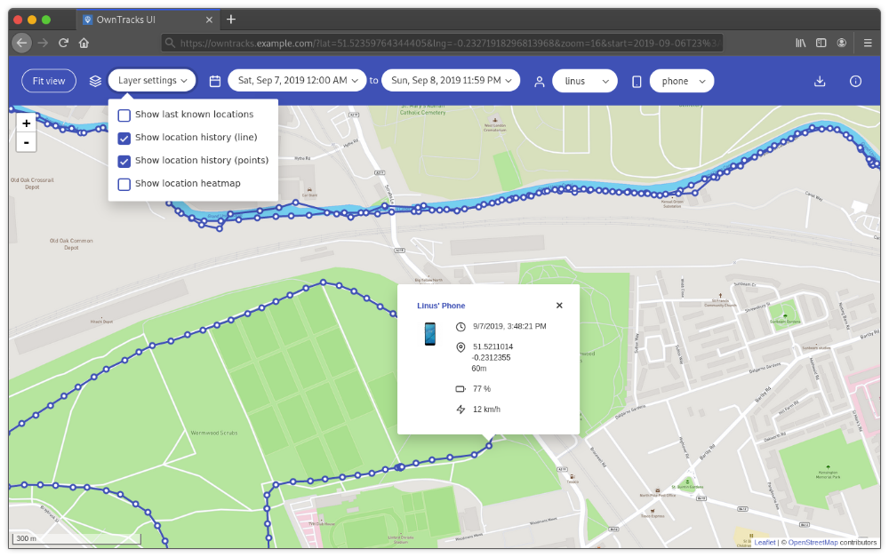

<!--
N.B.: Questo README è stato automaticamente generato da <https://github.com/YunoHost/apps/tree/master/tools/readme_generator>
NON DEVE essere modificato manualmente.
-->

# OwnTracks per YunoHost

[](https://dash.yunohost.org/appci/app/owntracks)  

[](https://install-app.yunohost.org/?app=owntracks)

*[Leggi questo README in altre lingue.](./ALL_README.md)*

> *Questo pacchetto ti permette di installare OwnTracks su un server YunoHost in modo semplice e veloce.*  
> *Se non hai YunoHost, consulta [la guida](https://yunohost.org/install) per imparare a installarlo.*

## Panoramica

This is a web interface for OwnTracks built as a Vue.js single page application. The recorder itself already ships with some basic web pages, this is a more advanced interface with more functionality, all in one place.

### Features

- Last known (i.e. live) locations:
- Location history (data points, line or both)
- Location heatmap
- Quickly fit all shown objects on the map into view
- Display data in a specific date and time range
- Filter by user or specific device
- Calculation of distance travelled
- Download selected location data as JSON
- Highly customisable


**Versione pubblicata:** 2.12.0~ynh1

## Screenshot



## Documentazione e risorse

- Sito web ufficiale dell’app: <https://owntracks.org/>
- Repository upstream del codice dell’app: <https://github.com/owntracks/frontend>
- Store di YunoHost: <https://apps.yunohost.org/app/owntracks>
- Segnala un problema: <https://github.com/YunoHost-Apps/owntracks_ynh/issues>

## Informazioni per sviluppatori

Si prega di inviare la tua pull request alla [branch di `testing`](https://github.com/YunoHost-Apps/owntracks_ynh/tree/testing).

Per provare la branch di `testing`, si prega di procedere in questo modo:

```bash
sudo yunohost app install https://github.com/YunoHost-Apps/owntracks_ynh/tree/testing --debug
o
sudo yunohost app upgrade owntracks -u https://github.com/YunoHost-Apps/owntracks_ynh/tree/testing --debug
```

**Maggiori informazioni riguardo il pacchetto di quest’app:** <https://yunohost.org/packaging_apps>
