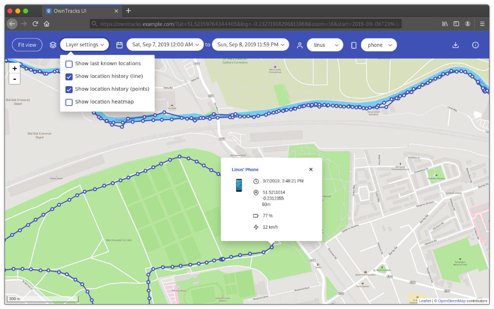

<!--
NB: Deze README is automatisch gegenereerd door <https://github.com/YunoHost/apps/tree/master/tools/readme_generator>
Hij mag NIET handmatig aangepast worden.
-->

# OwnTracks voor Yunohost

[](https://ci-apps.yunohost.org/ci/apps/owntracks/)


[](https://install-app.yunohost.org/?app=owntracks)

*[Deze README in een andere taal lezen.](./ALL_README.md)*

> *Met dit pakket kun je OwnTracks snel en eenvoudig op een YunoHost-server installeren.*  
> *Als je nog geen YunoHost hebt, lees dan [de installatiehandleiding](https://yunohost.org/install), om te zien hoe je 'm installeert.*

## Overzicht

This is a web interface for OwnTracks built as a Vue.js single page application. The recorder itself already ships with some basic web pages, this is a more advanced interface with more functionality, all in one place.

### Features

- Last known (i.e. live) locations:
- Location history (data points, line or both)
- Location heatmap
- Quickly fit all shown objects on the map into view
- Display data in a specific date and time range
- Filter by user or specific device
- Calculation of distance travelled
- Download selected location data as JSON
- Highly customisable


**Geleverde versie:** 2.15.3~ynh2

## Schermafdrukken



## Documentatie en bronnen

- Officiele website van de app: <https://owntracks.org/>
- Upstream app codedepot: <https://github.com/owntracks/frontend>
- YunoHost-store: <https://apps.yunohost.org/app/owntracks>
- Meld een bug: <https://github.com/YunoHost-Apps/owntracks_ynh/issues>

## Ontwikkelaarsinformatie

Stuur je pull request alsjeblieft naar de [`testing`-branch](https://github.com/YunoHost-Apps/owntracks_ynh/tree/testing).

Om de `testing`-branch uit te proberen, ga als volgt te werk:

```bash
sudo yunohost app install https://github.com/YunoHost-Apps/owntracks_ynh/tree/testing --debug
of
sudo yunohost app upgrade owntracks -u https://github.com/YunoHost-Apps/owntracks_ynh/tree/testing --debug
```

**Verdere informatie over app-packaging:** <https://yunohost.org/packaging_apps>
